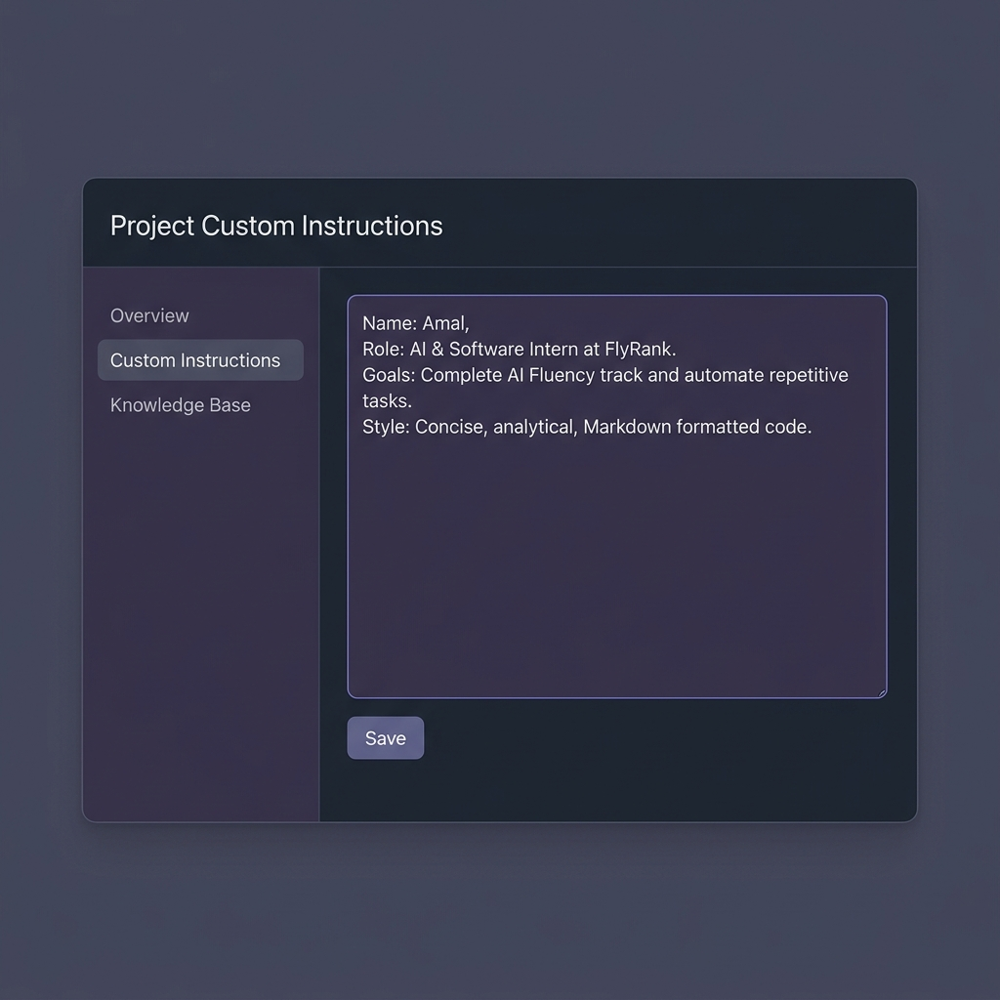

# AI Workflow Audit & Tool Setup (FL-01)
**Intern**: Amal  
**Role**: AI & Software Engineering Intern, FlyRank  
**Date**: July 12, 2026  

---

## 1. AI Workflow Audit
Below is the classification of 12 recurring tasks from a typical engineering and study week, mapped using the task-classification framework (inspired by Ethan Mollick's *On-boarding your AI Intern*).

| Task Name | Classification | Rationale |
| :--- | :--- | :--- |
| **1. React to TypeScript Refactoring** | **Collaborate with AI** | AI handles bulk type generation and interfaces, but I must make structural design decisions and verify runtime state flows. |
| **2. Writing Core Business Logic / Algorithms** | **Just Me** | Repetitive patterns don't apply to novel domain algorithms; AI hallucinations here lead to silent, high-risk bugs requiring manual ownership. |
| **3. Drafting Weekly Status Updates** | **Delegate to AI with Review** | Claude summarizes raw developer logs/commits into polished reports, requiring only my brief human-in-the-loop review. |
| **4. Writing Unit Tests for Utilities** | **Fully Automate** | Testing pure, deterministic functions is highly structured, allowing scripts to generate complete test suites automatically. |
| **5. Evaluating Technical Frameworks** | **Collaborate with AI** | AI synthesizes library pros/cons rapidly, but the final architectural choice must be manually weighed against our team constraints. |
| **6. Debugging Concurrency & Memory Leaks** | **Just Me** | Tracing complex race conditions and runtime heap dumps requires deep manual intuition and interactive debugging that AI cannot simulate. |
| **7. Setting Up DB Schemas & Migrations** | **Collaborate with AI** | AI generates SQL statements and schemas quickly, but manual oversight is necessary to ensure optimal relationships and indexes. |
| **8. Drafting Repetitive Support Answers** | **Delegate to AI with Review** | AI generates replies from FAQs, but a human must review each response to guarantee technical accuracy and maintain an empathetic tone. |
| **9. Running Application Deployments** | **Fully Automate** | CI/CD pipelines (e.g., GitHub Actions) handle builds and deployment without manual intervention or chatbot prompting. |
| **10. Studying Advanced Tech Papers** | **Collaborate with AI** | I use AI as an interactive tutor to break down math or obscure concepts, but internalizing and understanding is a personal cognitive task. |
| **11. Figma Designs to CSS Layouts** | **Collaborate with AI** | AI creates layouts and element boxes, but manual CSS tweaks are needed to polish animations, layout details, and responsiveness. |
| **12. Reviewing Peer Pull Requests** | **Just Me** | PR reviews require code context, team empathy, style alignment, and mentoring, which cannot be delegated to an AI model. |

---

## 2. Configured Claude Project Custom Instructions
A dedicated Claude Project has been set up with custom instructions to optimize interaction. The instructions are saved in `claude_project_instructions.txt`. 

### Claude Project Configuration Mockup:
Below is the screenshot mockup representing the configured Claude Project Settings:

---

## 3. Target Tasks & Success Definitions (FL-02 to FL-04)
The following three tasks have been selected for optimization and reuse in subsequent fluency assignments (FL-02 to FL-04):

### Target Task 1: React to TypeScript Refactoring (Collaborate with AI)
- **Context**: Porting existing React components from JavaScript (`.jsx`) to TypeScript (`.tsx`).
- **Success Definition ("Done Well")**: The component compiles with zero TypeScript errors (`tsc --noEmit`), contains no explicit `any` types (all types/interfaces are fully documented), and achieves a 100% pass rate on all existing unit tests in the test suite.

### Target Task 2: Writing Unit Tests for Utilities (Fully Automate)
- **Context**: Automatically generating a full suite of Jest tests for a utility file.
- **Success Definition ("Done Well")**: Running an automated codegen tool writes Jest tests that execute successfully, achieving 100% statement and branch coverage on the target utility file, without requiring any manual source-code edits to the generated test file.

### Target Task 3: Drafting Weekly Status Updates (Delegate to AI with Review)
- **Context**: Summarizing weekly commit logs into a high-level manager update.
- **Success Definition ("Done Well")**: The generated draft matches the company's reporting structure (Accomplishments, Next Steps, Blockers), matches all commits from the past week with 100% accuracy, and requires fewer than 3 minor wording edits before submission.

---

## 4. Toolkit & Academy Setup Verification
- [x] **Claude Free Account**: Configured with the project space and custom instructions.
- [x] **ChatGPT Free Account**: Setup completed for secondary model verification.
- [x] **Anthropic Academy Account**: Registered and enrolled in *AI Fluency: Framework & Foundations*.
- [x] **Module 1 Completed**: Completed the first module of the foundations course.
