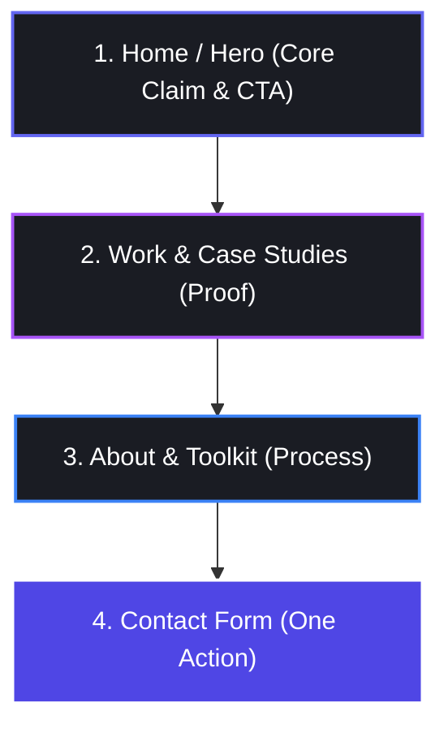
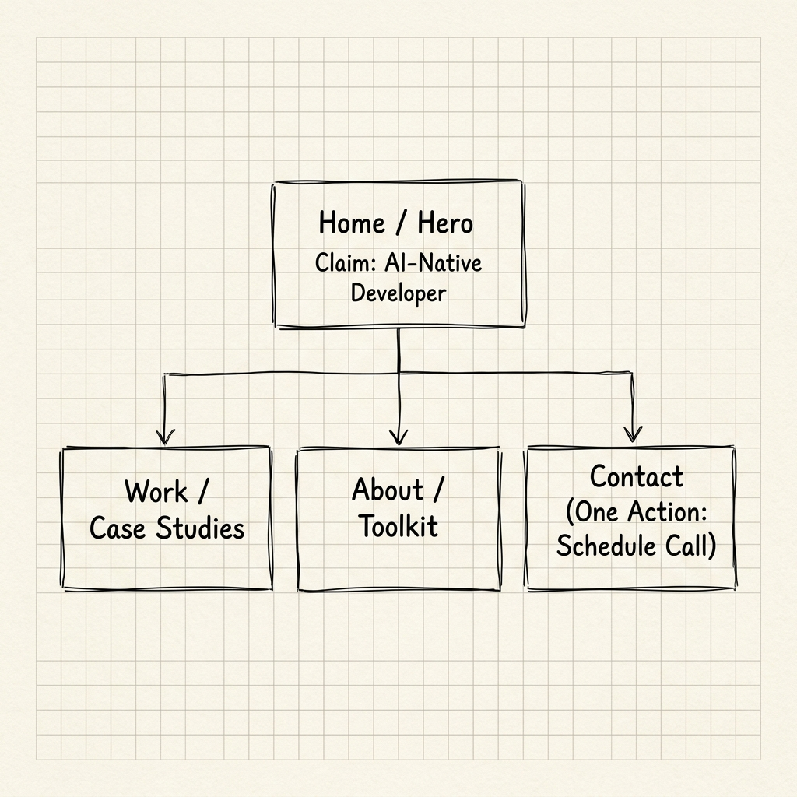
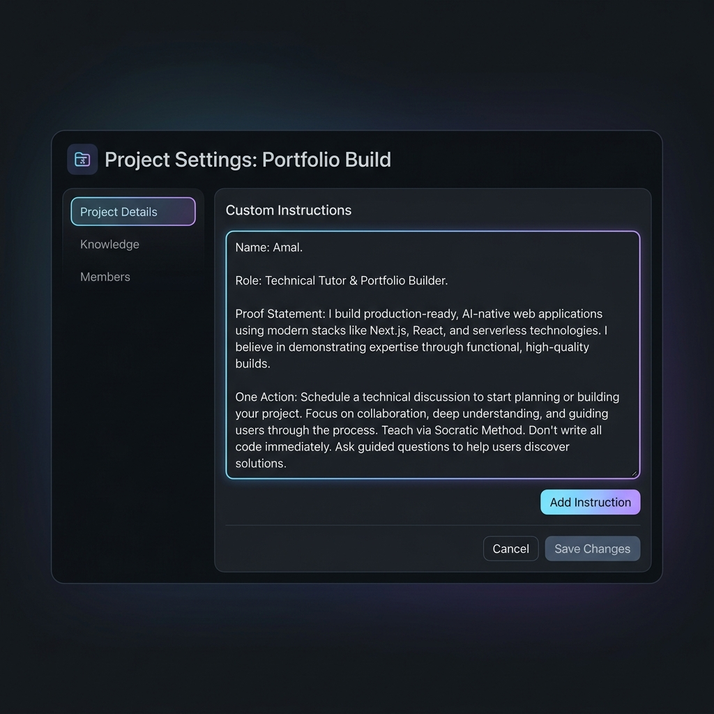

# Portfolio Sitemap & Toolkit (FL-02)
**Intern**: Amal  
**Role**: AI & Software Engineering Intern, FlyRank  
**Date**: July 12, 2026  

---

## 1. Portfolio Claim & One Action
*   **Core Claim (Proof Statement)**: *"I build production-ready, AI-native web applications and agentic workflows with clean, responsive code in a fraction of traditional timelines."*
*   **One Action**: *"Schedule a technical discussion / Contact for freelance or full-time opportunities."*

---

## 2. Portfolio Sitemap & Sketch
Following a rigorous pressure-test, the sitemap has been designed as a **single-page scrolling architecture** to minimize navigation friction and funnel visitors directly to the one action.

### Sitemap Structure (Sections):
1.  **Home / Hero (The Claim)**: High-impact introduction showing the proof statement and a prominent "Book a Call" CTA button.
2.  **Work / Case Studies (The Proof)**: Showcases real-world builds (such as FL-01, web builds, and workflows) with interactive previews and code repository links.
3.  **About / Toolkit (The Process)**: Highlights developer tools, AI-native workflows, and personal background.
4.  **Contact (The Action)**: Simple inline contact form that allows visitors to book a meeting or send a message immediately.

### Sitemap Flow (Mermaid):

### Sitemap Sketch Mockup:
Below is the design mockup representing the sitemap sketch:

---

## 3. Claude Project Configuration (Tutor & Builder)
A dedicated Claude Project named **Portfolio Build** was created with custom instructions to configure Claude as a Technical Tutor for this 8-week build. The full instructions are saved in `claude_project_instructions_tutor.txt`.

### Claude Project Configuration Mockup:
Below is the screenshot mockup of the configured Claude Project Settings page:

---

## 4. Sitemap Pressure-Test & Critical Change
We ran a pressure-test prompt to critique our initial sitemap ideas (saved in `claude_pressure_test.txt`).

*   **Tutor Feedback**: A multi-page structure introduces friction and navigation drop-off before the user reaches the "Contact Page". The portfolio should itself be a testament to efficiency.
*   **Critical Change Noted**: Converted the sitemap from a multi-page setup to a single-page scrolling layout. The "Contact Page" was replaced by a contact form section embedded directly on the homepage, with a persistent header button that smooth-scrolls users directly to it.

---

## 5. Toolkit Setup Verification
- [x] **Claude Account**: Active and configured with the "Portfolio Build" tutor project.
- [x] **ChatGPT Account**: Active for secondary model audits.
- [x] **Gemini Account**: Active for multimodal testing.
- [x] **Perplexity Account**: Active for real-time web search and technical research.
