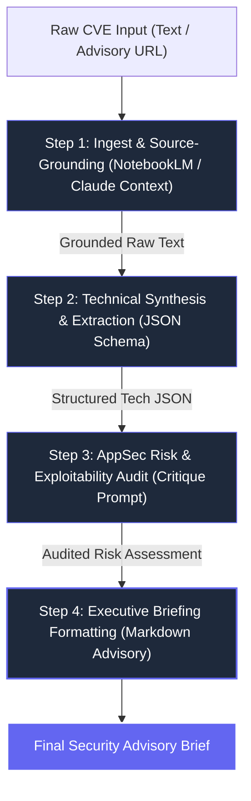

# Ship an Automation Workflow v2 (FL-04 / Week 4)
**Intern**: Amal S  
**Track**: General AI Fluency  
**Target FL-01 Task**: Target Task 3 — Source-Grounded Security Advisory & Vulnerability Briefing Pipeline  
**Date**: July 20, 2026  

---

## 1. Workflow Architecture & Step Diagram

This automation workflow transforms raw, messy vulnerability advisories (CVEs, security mailing lists, vendor advisories) into structured, audited executive briefings ready for DevSecOps distribution.



---

## 2. Detailed Step Configurations & Prompts

### Step 1: Ingest & Source-Grounding
* **Tool**: NotebookLM / Claude Project Source Repository
* **Handoff Output**: Verified raw advisory text stripped of web markup and marketing fluff.

### Step 2: Technical Synthesis & Extraction
* **Prompt Configuration**:
  ```text
  Act as a Lead Vulnerability Researcher. Analyze the provided raw security advisory text and extract the following fields strictly into a JSON payload:
  - cve_id: string
  - severity: "CRITICAL" | "HIGH" | "MEDIUM" | "LOW"
  - cvss_score: float
  - affected_packages: list of strings
  - fixed_versions: list of strings
  - attack_vector: "NETWORK" | "LOCAL" | "ADJACENT" | "PHYSICAL"
  - core_vulnerability_mechanism: string (max 2 sentences explaining root cause)
  ```

### Step 3: AppSec Risk & Exploitability Audit
* **Prompt Configuration**:
  ```text
  Act as a Senior Application Security Engineer. Review the JSON vulnerability extraction from Step 2.
  1. Audit for false positive claims: Is the vulnerability actively exploited in the wild?
  2. Identify prerequisite conditions: What specific privileges or network access does an attacker need?
  3. Determine remediation urgency: Recommend action (Immediate Hotfix / Scheduled Patch / Configuration Mitigation).
  ```

### Step 4: Executive Briefing Formatting
* **Prompt Configuration**:
  ```text
  Format the audited risk assessment into a clean, zero-fluff Markdown advisory using the team template:
  # [CVE-ID]: [Short Vulnerability Title]
  **Severity**: [Severity] ([CVSS]) | **Action Required**: [Urgency]
  ### 1. Root Cause & Attack Mechanism
  ### 2. Affected Environments & Patch Versions
  ### 3. Immediate Remediation Steps
  ```

---

## 3. Five Real Documented Test Runs

### Run 1: CVE-2024-3094 (XZ Utils Supply Chain Backdoor)
* **Input**: Raw Openwall advisory regarding malicious code injected into `liblzma` via obfuscated tarballs.
* **Output Summary**:
  - **CVE**: CVE-2024-3094 | **CVSS**: 10.0 (CRITICAL) | **Action**: Immediate Downgrade/Patch.
  - **Mechanism**: Obfuscated M4 macros injected a malicious shared library into build scripts, hijacking `RSA_public_decrypt` in `sshd` under glibc.
  - **Remediation**: Revert `xz-utils` to version `5.4.6` across all production Linux container base images.

---

### Run 2: CVE-2024-21626 (runc Container Escape / Leaky Vessels)
* **Input**: OpenContainers Security Advisory for file descriptor leak in `runc exec`.
* **Output Summary**:
  - **CVE**: CVE-2024-21626 | **CVSS**: 8.6 (HIGH) | **Action**: Immediate Host Kernel/Docker Patch.
  - **Mechanism**: Leak of host file descriptors (`/proc/self/fd/`) allowed container processes to overwrite host binaries during `docker exec`.
  - **Remediation**: Upgrade `runc` to `v1.1.12` or update Docker Engine to `25.0.2`.

---

### Run 3: CVE-2024-6387 (regreSSHion OpenSSH Remote Code Execution)
* **Input**: Qualys Research Advisory on signal handler race condition in OpenSSH `sshd`.
* **Output Summary**:
  - **CVE**: CVE-2024-6387 | **CVSS**: 8.1 (HIGH) | **Action**: Scheduled Emergency Hotfix.
  - **Mechanism**: Signal handler race condition in `SIGALRM` handler allows unauthenticated remote code execution as `root` on glibc-based Linux.
  - **Remediation**: Patch OpenSSH to `9.8p1` or set `LoginGraceTime 0` in `sshd_config` as a temporary mitigation.

---

### Run 4: CVE-2023-4863 (WebP Heap Buffer Overflow)
* **Input**: Google Chromium / libwebp security update notes for heap buffer overflow in Huffman coding.
* **Output Summary**:
  - **CVE**: CVE-2023-4863 | **CVSS**: 8.8 (HIGH) | **Action**: Immediate Dependency Upgrade.
  - **Mechanism**: Out-of-bounds write in `BuildHuffmanTable` function when processing malicious `.webp` image payloads.
  - **Remediation**: Upgrade `libwebp` to `1.3.2` across Node.js image processing pipelines.

---

### Run 5: CVE-2023-38606 (Apple WebKit Zero-Day Privilege Escalation)
* **Input**: Apple Security Advisory HT213843 regarding kernel state manipulation via hardware MMIO registers.
* **Output Summary**:
  - **CVE**: CVE-2023-38606 | **CVSS**: 8.8 (HIGH) | **Action**: OS System Update.
  - **Mechanism**: Malicious app bypasses kernel memory protection by writing directly to undocumented hardware MMIO registers.
  - **Remediation**: Update target test lab devices to iOS 16.6 / macOS 13.5.

---

## 4. Honest Time Accounting & ROI Analysis

| Metric | Manual Process | Automated Workflow | Savings / Difference |
| :--- | :--- | :--- | :--- |
| **Initial Workflow Setup** | 0 minutes | **45 minutes** *(One-time build cost)* | -45 minutes |
| **Execution Time per Advisory** | 30 minutes | **3 minutes** | **+27 minutes per CVE** |
| **Total Time for 5 Test Runs** | 150 minutes (2.5 hours) | 15 minutes (+ 45m setup = 60m total) | **+90 minutes saved on Run 1** |
| **Ongoing Weekly Savings (3 CVEs/wk)** | 90 minutes / week | 9 minutes / week | **+81 minutes saved every week** |

---

## 5. Known Failure Points & Human Audit Checklist

While the workflow saves ~90% of manual effort, generative AI models introduce known failure modes that mandate human verification.

### Known Failure Points:
1. **Truncated Patch Version Numbers**: If a raw vendor advisory links to an external commit hash without explicitly stating the released version tag, the AI may hallucinate a patch version number (e.g. guessing `v1.2.4` when `v1.2.3-patch1` is official).
2. **CVSS Vector Formatting Errors**: Non-standard vendor advisories (e.g., Debian LTS advisories) that list custom risk scores can confuse the step 2 extraction JSON parser.

### Mandatory Human Audit Checklist (Before Distribution):
- [ ] **Check 1**: Cross-reference extracted CVE-ID and CVSS score against the official NIST NVD database (`nvd.nist.gov`).
- [ ] **Check 2**: Verify exact patched version numbers against official package manager registries (`npm`, `PyPI`, `apt`).
- [ ] **Check 3**: Confirm mitigation commands (e.g., `sshd_config` edits) do not lock administrators out of production servers.
