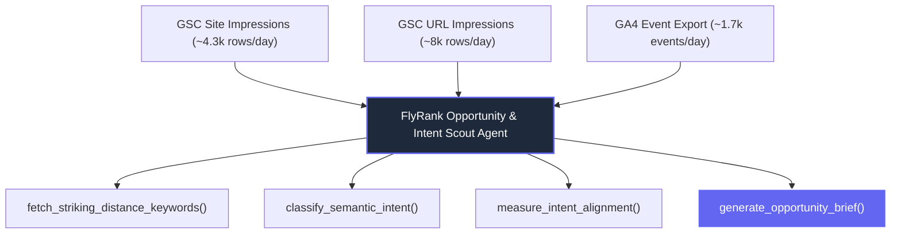

# Design Your Personal Agent: FlyRank Opportunity & Intent Scout Agent (FL-06 / Week 5)
**Intern**: Amal S  
**Track**: General AI Fluency  
**Client Project**: FlyRank AI Hackathon Brief (Client Data: Flewd)  
**Date**: July 20, 2026  

---

## 1. Job to Be Done & Scope Specification

### Agent Name: **FlyRank Opportunity & Intent Scout Agent**

### Problem Statement
Static analytics dashboards present raw numbers (impressions, clicks, bounce rates) but fail to answer actionable strategic questions: *Which striking-distance queries are hiding immediate revenue wins? Where is page content mismatched with user search intent? Which pages are cannibalizing each other's search traffic?*

### Job to Be Done
The agent autonomously ingests client search data (Google Search Console & GA4 raw exports), identifies high-impact content opportunities, classifies deep search intent (*Comparison*, *Replacement*, *Risk/Safety*, *Use-Case*), measures content vs. performance alignment, and outputs a ranked Markdown **Content Opportunity Action Brief**.

### Target User & Usage Frequency
* **Target User**: Amal S (AI & Cybersecurity Engineering Intern) and FlyRank Strategy Leads.
* **Usage Frequency**: Weekly client optimization sprints and pre-sprint client reviews.
* **Build Time Scope**: Strictly scoped to **10 build hours** using modular Python scripts and Claude Project instructions.

---

## 2. Tools & Data Sources with Access Plan

The agent interacts with three live client datasets provided by FlyRank for the client **Flewd** (stress-care & magnesium bath soak brand):



### Data Access Plan:
1. **GSC Site Impressions** (`gsc_site_impressions.csv`): Query-level search demand (~4,300 rows/day, 2,600 unique queries across 167 countries). Stored locally in `Backend/data/flewd/`.
2. **GSC URL Impressions** (`gsc_url_impressions.csv`): Page-level data with SERP feature flags (~8,000 rows/day across 258 URLs). Stored locally.
3. **GA4 Raw Event Export** (`ga4_raw_events.json`): Event data covering page views, sessions, add-to-cart, and purchases (~1,700 events/day). JSON nested fields flattened using Pandas.

### Agent Tools Definition:
- `fetch_striking_distance_keywords(min_pos=3, max_pos=15, min_impressions=1000)`: Python Pandas tool extracting queries in position 3–15 with high demand but sub-optimal CTR.
- `classify_semantic_intent(query_list)`: Zero-shot LLM / Sentence-Transformers tool categorizing queries into *Comparison*, *Replacement*, *Risk/Safety*, *Use-Case*, and *Transaction*.
- `measure_intent_alignment(url_path)`: Joins GSC URL impressions with flattened GA4 ecommerce data on `landing_page_url` to calculate conversion vs. search intent alignment.
- `generate_opportunity_brief(cluster_id)`: Assembles model findings into a ranked action brief sorted by predicted business impact.

---

## 3. System Prompt & Draft Agent Instructions

```text
Act as the FlyRank Senior Search Intelligence Agent. Your job is to analyze GSC and GA4 datasets for Flewd to surface high-priority content actions that drive organic revenue.

Step-by-Step Execution Loop:
1. Load and flatten GSC and GA4 datasets from Backend/data/flewd/.
2. Filter for striking-distance queries (positions 3–15, >1,000 impressions, CTR < 2%).
3. Classify query intent into deep behavioral categories:
   - Comparison ("magnesium taurate vs glycinate")
   - Replacement ("alternative to epsom salt")
   - Risk / Safety ("is magnesium bath safe during pregnancy")
   - Use-Case ("magnesium soak for muscle recovery")
4. Join GSC URL impressions with GA4 event data strictly on `landing_page_url`.
5. Identify pages ranking in top 5 with high traffic but zero GA4 add-to-cart events (Intent Mismatch).
6. Output a ranked Markdown Content Opportunity Action Brief sorted by expected revenue impact.
```

---

## 4. Five Pre-Build Eval Cases (FL-03 Style)

Before building, five explicit test evaluation cases are defined to verify agent accuracy:

| Eval Case | Input Data Scenario | Expected Agent Behavior & Output | Pass Criteria |
| :--- | :--- | :--- | :--- |
| **Eval 1: Striking Distance Opportunity** | Query `"magnesium bath soak for sleep"` ranking in position 7.2 with 4,500 impressions and 1.1% CTR. | Agent flags query, recommends title tag optimization ("Magnesium Bath Soak for Sleep | Flewd"), and estimates +350 monthly clicks. | Correctly isolates positions 3–15 with high impressions & low CTR. |
| **Eval 2: Deep Intent Categorization** | Queries: `"epsom salt alternative"` and `"magnesium taurate vs glycinate"`. | Classifies `"epsom salt alternative"` as *Replacement* intent and `"magnesium taurate vs glycinate"` as *Comparison* intent. | 0% generic "Informational" fallback; assigns specific behavioral bucket. |
| **Eval 3: Anonymized Query Handling** | GSC URL dataset contains ~36% anonymized blank query rows (`query == ""`). | Agent ignores blank queries during query-level intent modeling, but preserves impression totals on landing page URL aggregation. | Zero NaN/Null crashes; handles privacy anonymization gracefully. |
| **Eval 4: Content vs. Intent Mismatch** | URL `/products/recovery-soak` ranks #2 for `"best magnesium for sore muscles"`, gets 1,200 views/day, but has 0% GA4 add-to-cart. | Agent flags intent mismatch: user wants comparison proof, but page is a hard-sell checkout page without use-case explanation. | Detects high-impression/high-traffic pages with zero conversions. |
| **Eval 5: Keyword Cannibalization** | URLs `/soak-guide` and `/products/magnesium-soak` both rank in positions 8 and 11 for `"magnesium bath soak"`. | Agent flags cannibalization warning and recommends consolidating content or setting canonical tags. | Detects multiple URLs competing for the exact same query cluster. |

---

## 5. Risks & Guardrails Specification

To prevent erroneous recommendations or data corruption, explicit guardrails are hardcoded into the agent logic:

### What the Agent MUST Confirm:
- **URL Join Integrity**: Must confirm `landing_page_url` strings match exactly (normalizing trailing slashes and query parameters) before joining GSC and GA4 datasets.
- **Conversion Verification**: Must verify whether a page has historical GA4 purchase revenue before making structural recommendations.

### What the Agent MUST NEVER Do:
- **NEVER Join GSC and GA4 on Query Strings**: GSC and GA4 cannot be joined directly on search queries (GA4 strips organic query dimensions for privacy). The agent must strictly join on `landing_page_url`.
- **NEVER Recommend Deleting Revenue-Generating Pages**: If a page has generated >$0 in GA4 purchase revenue over the last 30 days, the agent is strictly forbidden from recommending page deletion or retirement.
- **NEVER Expose Confidential Client Data**: Flewd dataset records must be processed locally inside `Backend/data/flewd/` and never uploaded to public third-party APIs.

---

## 6. Build Platform Choice & Justification

### Chosen Platform: **Python Scripted Agent + Claude Project Custom Instructions**

### Justification Against Alternatives:

| Platform Option | Cost | Data Handling Capability | Privacy & Constraints | Build Feasibility (~10 Hours) |
| :--- | :--- | :--- | :--- | :--- |
| **Python Script + Claude (CHOSEN)** | **$0** | **Native Pandas, NumPy, Scikit-Learn, Sentence-Transformers** | **100% Local & Confidential** | **Achievable in 8–10 hours** |
| **n8n Workflow Agent** | $0 (Self-Hosted) | Weak native data-frame aggregation for 8,000+ CSV rows | Good | High setup friction for nested JSON flattening |
| **Custom GPT (OpenAI)** | Requires Paid Plan | File upload limits on 8,000+ row GSC/GA4 exports | Uploads client data to cloud | Restricted by file sandbox memory limits |

*Conclusion: The Python Scripted Agent + Claude Project path is $0, provides full local control over heavy pandas data aggregations, preserves Flewd client confidentiality, and can be completed end-to-end within 10 build hours.*
