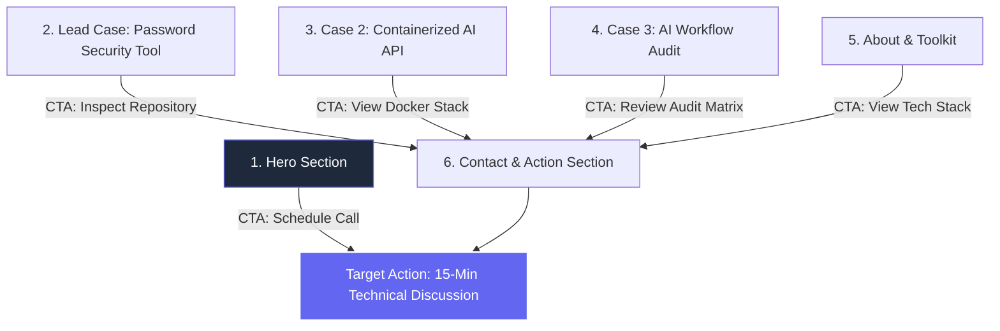

# The Through-Line: Map Content & CTAs (FL-08 / Week 3)
**Intern**: Amal S  
**Track**: General AI Fluency  
**Date**: July 20, 2026  

---

## 1. One-Line Claim Generation & Selection

To craft a memorable single-sentence claim that greets a visitor and state what is proven, 10 options were generated and evaluated:

### 10 Generated Options:
1. *"I build high-performance web applications using modern AI technologies."* (Too generic, corporate fluff).
2. *"I am a Computer Science student passionate about full-stack development and security."* (Focuses on student status, not proof).
3. *"I design and build secure Python scripts and backend Node.js APIs."* (Purely technical list, lacks impact).
4. *"I help teams build AI agentic workflows in half the traditional timeline."* (Good, but omits cybersecurity core).
5. *"I build secure-by-design backend tools and AI-native web applications that don't break in production."* **(SELECTED & SHARPENED)**
6. *"I combine cryptographic tool building with AI backend automation."* (Accurate, but a bit dry).
7. *"I turn complex security requirements into production-ready software."* (Strong, but missing AI focus).
8. *"I engineer hardened Python tools and containerized Docker stacks for modern teams."* (Focuses on tools, not outcomes).
9. *"I build reliable, zero-fluff software using AI-native workflows."* (Too abstract).
10. *"I audit codebases for security vulnerabilities and build automated AI backends."* (A bit fragmented).

---

### Selected One-Line Claim:
> **"I build secure-by-design backend tools and AI-native web applications that don't break in production."**

*Rationale: It names both primary capabilities (secure backend tools + AI-native apps) in a single tight sentence, communicates reliability ("don't break in production"), and avoids corporate buzzwords.*

---

## 2. Section-by-Section Content Map & CTA Hierarchy

The portfolio is structured as a **single-page scrolling landing page**. Sections are ordered to place the strongest technical work first, and every section includes a named Call to Action (CTA) that ladders directly up to the **One Action**: *Schedule a 15-Minute Technical Discussion*.

---

### Content Map Breakdown

| Order | Section Name | Content & Copy Elements | Visual Asset Reference | Section Call to Action (CTA) |
| :--- | :--- | :--- | :--- | :--- |
| **1** | **Hero / Claim** | • Developer Name & Title • One-Line Claim • Voice Card Badge: *"Direct, sharp, plain-spoken, technical, zero fluff."* | `real_headshot_photo.png` `portfolio_favicon_logo.png` | `[Schedule Technical Discussion]` *(Primary Target Action CTA)* |
| **2** | **Lead Work: Password Security Tool** *(Strongest)* | • 3-Beat Case Study • Argon2id & Bloom Filter $O(1)$ lookup explanation • Sub-millisecond speed metric | `password_tool_cli_output.png` *(Real CLI capture)* | `[Inspect Code Repository]` $\rightarrow$ *Scrolls to Contact section with repo context* |
| **3** | **Secondary Work: Containerized AI Stack** | • 3-Beat Case Study • Decoupled 4-tier architecture • Gemini/Groq LLM extraction logs | `docker_compose_curl_terminal.png` *(Real terminal capture)* | `[View Docker Architecture]` $\rightarrow$ *Scrolls to Contact section* |
| **4** | **Tertiary Work: AI Workflow Audit** | • 3-Beat Case Study • Ethan Mollick 12-task matrix • 4-hour weekly time savings | `fl01_audit_matrix_table.png` *(Real table capture)* | `[Review Audit Breakdown]` $\rightarrow$ *Scrolls to Contact section* |
| **5** | **About / Toolkit** | • Short technical bio • Cybersecurity & AI stack badges • Identity Kit style note summary | Monogram Badge & Stack Icons | `[Review Technical Skills]` $\rightarrow$ *Scrolls to Contact section* |
| **6** | **Contact & Action** *(Final Funnel)* | • Quick technical query form • Direct Calendly scheduling widget • GitHub & LinkedIn profile links | Calendly Embed Widget | **`[Schedule a 15-Minute Technical Discussion]`** *(Ultimate Target Action)* |

---

## 3. "Still Need to Gather" Asset Inventory

To ensure build week runs without roadblocks, the following assets and links are inventoried for final gathering:

- [x] **One-Line Claim & Voice Card**: Complete and verified.
- [x] **Monogram Logo Asset**: `portfolio_favicon_logo.png` generated and ready.
- [x] **Case Study Text (3 Beats each)**: Complete in `FL-04_Framed_Cases_Work_That_Speaks.md`.
- [ ] **Real Headshot Photo**: Select clean high-resolution headshot for `real_headshot_photo.png`.
- [ ] **GitHub Repository Links**: Ensure public repository links for Password Tool (`github.com/amalsab2008/password-security-tool`) are active.
- [ ] **Terminal GIF Recording**: Record a 5-second terminal GIF showing `docker compose up` and instant `curl` JSON API responses.
- [ ] **Calendly Link**: Finalize Calendly scheduling URL for the 15-minute technical discussion widget.
