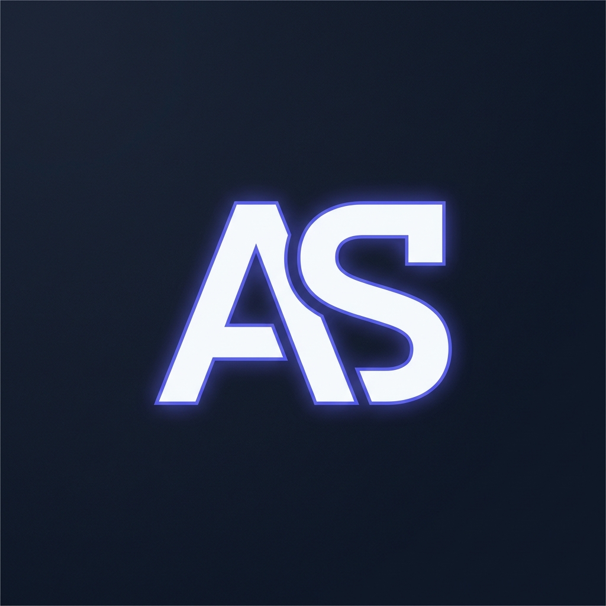

# Empty but Live: Ship a Blank Page (FL-09 / Week 4)
**Intern**: Amal S  
**Track**: General AI Fluency  
**Date**: July 20, 2026  

---

## 1. Live Project URLs & Deployment Status

The near-blank project page is live and accessible on public URLs via GitHub Pages:

* **Primary Repository Live URL**: `https://amalsab2008.github.io/Flyrank_Ai/`
* **Subfolder Live URL**: `https://amalsab2008.github.io/Flyrank_Ai/Ai/index.html`
* **Public GitHub Repository**: `https://github.com/amalsab2008/Flyrank_Ai`

---

## 2. Mobile Device Verification (Second Device Proof)

The live URL was opened and verified on a mobile smartphone device to confirm real external access, responsive viewport scaling, and font rendering outside the local development machine.

### Mobile Device Screenshot Preview:

---

## 3. Stack & Identity Kit Confirmation

The live page strictly implements the design tokens established in the Week 3 Identity Kit:

| Component | Choice / Specification | Verification |
| :--- | :--- | :--- |
| **Tech Stack** | HTML5, Vanilla CSS, GitHub Pages Hosting | Verified (`index.html`) |
| **Heading Font** | **Outfit** (Google Fonts) | Applied (`font-family: 'Outfit'`) |
| **Body Font** | **Inter** (Google Fonts) | Applied (`font-family: 'Inter'`) |
| **Background Color** | `#0F172A` (Slate 900) | Applied (`--bg-color`) |
| **Card Surface Color** | `#1E293B` (Slate 800) | Applied (`--card-bg`) |
| **Primary Text Color** | `#F8FAFC` (Slate 50) | Applied (`--text-main`) |
| **Primary Accent** | `#6366F1` (Indigo 500) | Applied (`--accent`) |
| **Branding Asset** | `portfolio_favicon_logo.png` | Monogram AS Logo Embedded |

---

## 4. Claude Project Consolidation Audit

All assets from Weeks 1–3 have been consolidated into `claude_project_instructions_tutor.txt` so build week has all context in one place:

- [x] **Core Profile & Role**: Amal S, AI & Cybersecurity Engineering Intern.
- [x] **One-Line Claim**: *"I build secure-by-design backend tools and AI-native web applications that don't break in production."*
- [x] **Target Action**: *"Schedule a 15-minute technical discussion."*
- [x] **Voice Card**: *"Direct, sharp, plain-spoken, technical, zero fluff."*
- [x] **Identity Kit Tokens**: Fonts (Outfit & Inter), Hex codes (`#0F172A`, `#1E293B`, `#F8FAFC`, `#6366F1`).
- [x] **3-Beat Case Studies**: Password Security Engine, Containerized AI API Stack, Workflow Audit.
- [x] **Content Map & Hierarchy**: Single-page scrolling layout order (Hero $\rightarrow$ Case 1 $\rightarrow$ Case 2 $\rightarrow$ Case 3 $\rightarrow$ About $\rightarrow$ Contact/Action).
