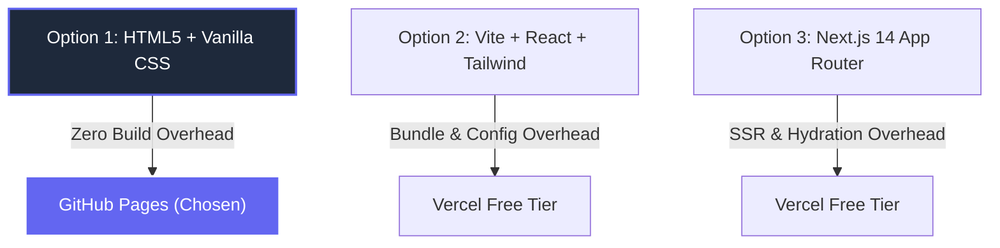

# Three Roads: Choose Your Stack with AI (FL-10 / Week 4)
**Intern**: Amal S  
**Track**: General AI Fluency  
**Date**: July 20, 2026  

---

## 1. The Four Input Constraints

To evaluate stack options objectively, four real constraints were defined:

1. **Cost Constraint**: **$0 Budget** (Strictly free hosting, free domain, free deployment pipelines).
2. **Honest Skill Level**: Computer Science Engineering student skilled in Python script automation, Node.js backend API architecture, and basic HTML/CSS/JS. Limited interest in fighting complex JavaScript bundler configurations for a static portfolio.
3. **Portfolio Purpose (Sitemap & Content Map)**: A single-page scrolling landing page displaying 3 technical case studies, terminal logs, code snippets, and funneled CTAs leading to a 15-minute technical discussion.
4. **Display & Technical Requirements**: High-contrast dark slate theme (`#0F172A`), Google Fonts (`Outfit` & `Inter`), responsive viewport scaling, and static code blocks.

---

## 2. Three Stack Options (Simplest to Most Powerful)

---

### Option 1: HTML5 + Vanilla CSS + Plain JavaScript (Simplest — CHOSEN)
* **How Built**: Native HTML5 semantic elements, Vanilla CSS using Identity Kit CSS variables (`#0F172A`, `#1E293B`, `#F8FAFC`, `#6366F1`), and minimal plain JS for smooth scrolling.
* **Hosting**: GitHub Pages ($0 free hosting on `https://amalsab2008.github.io/Flyrank_Ai/`).
* **Backend Needed?**: **No.** (Static landing page; forms use native `mailto:` or static integrations).
* **Real Trade-off**: Zero build step and instant load times, but if the site expands to 20+ pages in the future, header/footer elements must be copied manually.

---

### Option 2: Vite + React + TailwindCSS (Balanced / Modern)
* **How Built**: Single-Page Application (SPA) using React components, Vite dev server, and Tailwind utility classes.
* **Hosting**: Vercel Free Tier or Netlify ($0).
* **Backend Needed?**: **No.**
* **Real Trade-off**: Modular reusable JSX components, but introduces `node_modules` dependency management, Vite build configuration steps, and bundle sizes for static content.

---

### Option 3: Next.js 14 App Router + React + TailwindCSS (Most Powerful)
* **How Built**: React Server Components (RSC), Server-Side Rendering (SSR), and built-in API routes.
* **Hosting**: Vercel Free Tier ($0).
* **Backend Needed?**: **Optional** (Supports built-in Node.js API endpoints).
* **Real Trade-off**: Full-stack capabilities, but massive architectural overkill for a single-page portfolio. High risk of SSR re-hydration bugs, complex build errors, and continuous package updates.

---

## 3. Pressure-Testing the Options

1. **What breaks if I pick the simplest (Option 1)?**
   - *Answer*: **Nothing breaks.** HTML5 and Vanilla CSS natively support custom design variables (`#0F172A`), Google Fonts, embedded terminal code snippets, and responsive viewports with 100/100 Lighthouse performance.

2. **What do I maintain if I pick the most powerful (Option 3)?**
   - *Answer*: I become a full-time maintainer of Next.js package upgrades, npm security vulnerabilities, Vercel build failures, and hydration bugs—wasting hours fighting tooling instead of polishing case study proof.

3. **Can I finish in two weeks?**
   - *Option 1*: Yes, complete build in < 2 days.
   - *Option 3*: Risk spending 10 days debugging build pipelines and CSS utility classes.

4. **Does it show my work the way it needs to be shown?**
   - *Answer*: Yes. Terminal logs, code blocks, and case study beats render perfectly in semantic HTML code blocks (`<pre><code>`) with custom CSS syntax styling.

---

## 4. Honest Backend Answer

> **Do I need a backend for my portfolio yet?**  
> **Answer: Not yet.**

*Rationale: The portfolio website itself is a static proof display. My actual backend engineering capabilities are demonstrated inside the case studies (e.g., Case Study 2: Decoupled AI Task API running Node.js, Express, Postgres, and Docker Compose). Hosting a separate live backend database server just to render a static 1-page portfolio adds unnecessary hosting costs and downtime risks.*

---

## 5. Final Decision Rationale (In My Own Words)

### Chosen Stack: **Option 1 (HTML5 + Vanilla CSS + Plain JS on GitHub Pages)**

### Why I Chose Option 1:
- **Can I maintain this?**: **Yes, effortlessly.** There are zero `npm` packages to break, zero build pipelines to fail, and zero bundler deprecations. Updating a case study metric takes 30 seconds of plain text editing.
- **Does it show my work well?**: **Exceptionally well.** Vanilla CSS gives 100% precise control over the `#0F172A` slate identity tokens and typography hierarchy without fighting framework defaults.

### Why I Rejected Options 2 and 3:
- **Rejected Option 2 (Vite + React)**: Adding React component abstraction and Tailwind compilation for a single-page scrolling site adds complexity without delivering any visible benefit to a visiting hiring manager.
- **Rejected Option 3 (Next.js 14)**: Next.js is built for multi-page dynamic web applications. Using Server-Side Rendering for static portfolio copy is engineering vanity that introduces unnecessary failure points.
