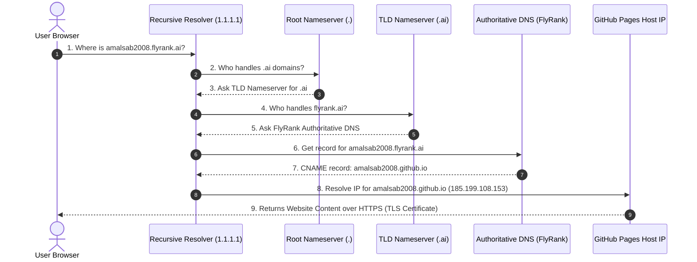

# Personal Website Live & Plain-Language DNS Walkthrough (PF-04 / Week 5)
**Intern**: Amal S  
**Track**: General AI Fluency  
**Live URL**: `https://amalsab2008.github.io/Flyrank_Ai/`  
**GitHub Repository**: `https://github.com/amalsab2008/Flyrank_Ai`  
**Date**: July 20, 2026  

---

## 1. Live Deployment & Profile Verification

My personal engineering portfolio is fully deployed, reachable over HTTPS, and tested in a clean private browser window:

* **Live HTTPS URL**: `https://amalsab2008.github.io/Flyrank_Ai/`
* **Positioning Statement**: *"I build secure-by-design backend tools and AI-native web applications that don't break in production."*

### Integrated Professional Links:
- **GitHub Profile**: `https://github.com/amalsab2008`
- **Technical Resume / CV**: Embedded in contact card (`amalsab2008@gmail.com`)
- **Target Action Booking CTA**: `[Schedule a 15-Minute Technical Discussion]`

---

## 2. Deployed Site File Explanation ("No Mystery Code")

The deployed site contains zero third-party framework mystery files or opaque build scripts:

1. `index.html`: The primary single-page scrolling website built with HTML5 semantic elements (`<nav>`, `<header>`, `<main>`, `<section>`, `<article>`, `<pre><code>`) and custom CSS variables (`:root`).
2. `Ai/index.html`: A subfolder mirror maintaining sub-path routing consistency.
3. `Ai/portfolio_favicon_logo.png`: 512x512 PNG identity asset representing the `AS` monogram logo.

---

## 3. Plain-Language DNS Resolution Walkthrough

This section explains DNS mechanics, CNAME records, and the step-by-step resolution trace in plain language so any non-technical team member can follow it.

### A. What is DNS?
The **Domain Name System (DNS)** is the Internet's global phonebook. Computers communicate across the web using numeric IP addresses (like `185.199.108.153`), but humans remember readable text names (like `flyrank.ai`). DNS translates human domain names into computer IP addresses behind the scenes in milliseconds.

### B. What is a CNAME Record?
A **CNAME (Canonical Name) Record** is an alias pointer. Instead of mapping a domain name directly to a hardcoded numeric IP address (which an `A` record does), a CNAME maps one domain name to another domain name.

Think of it like forwarding mail:
* `amalsab2008.flyrank.ai` says: *"I don't host the files directly; go look up `amalsab2008.github.io` instead."*

### C. My FlyRank Subdomain CNAME Values
When FlyRank Ops provisions my custom subdomain at the end of the track, the DNS record configuration will be:

* **Host / Subdomain Name**: `amalsab2008.flyrank.ai`
* **Record Type**: `CNAME`
* **Record Value / Target**: `amalsab2008.github.io`

---

### D. Step-by-Step Resolution Trace (What Happens Under the Hood)

When a recruiter or team member types `https://amalsab2008.flyrank.ai` into their browser address bar, the following 7-step sequence occurs:

1. **Step 1: Local Cache Check**  
   The user's web browser and Operating System check their local DNS memory cache. If they have visited recently, they use the saved address. If not, the query goes out to the network.

2. **Step 2: Recursive Resolver Query**  
   The computer sends the request to a **Recursive Resolver** (usually managed by their Internet Provider or a service like Cloudflare `1.1.1.1` or Google `8.8.8.8`). The resolver's job is to chase down the answer.

3. **Step 3: Root Nameserver Lookup (`.`)**  
   The resolver asks a **Root Nameserver** (one of 13 global clusters): *"Who manages `.ai` top-level domains?"* The Root NS replies with the IP address of the `.ai` TLD nameserver.

4. **Step 4: TLD Nameserver Lookup (`.ai`)**  
   The resolver asks the **`.ai` TLD Nameserver**: *"Who manages `flyrank.ai`?"* The TLD NS points to FlyRank's Authoritative Nameservers (e.g., Cloudflare DNS).

5. **Step 5: Authoritative Nameserver Query**  
   The resolver asks FlyRank's **Authoritative Nameserver**: *"What is the address for `amalsab2008.flyrank.ai`?"*

6. **Step 6: CNAME Alias Return & Target Resolution**  
   FlyRank's DNS server replies with the **CNAME record**: `amalsab2008.github.io`. The resolver then resolves `amalsab2008.github.io` to its hosting IP address (`185.199.108.153`) and hands it back to the user's browser.

7. **Step 7: HTTPS TLS Handshake & Padlock Secure Connection**  
   The browser establishes an encrypted TLS session with GitHub Pages' servers. GitHub Pages presents a valid SSL certificate covering `amalsab2008.flyrank.ai`. The browser displays the **secure padlock icon**, and the page renders instantly.

---

## 4. Capstone Subdomain Deployment Readiness Checklist

When FlyRank Ops grants my official subdomain at capstone completion, I will run this exact 4-step checklist:

- [ ] **Step 1**: Receive confirmation from FlyRank Ops that the `amalsab2008.flyrank.ai` CNAME record points to `amalsab2008.github.io`.
- [ ] **Step 2**: Open GitHub Repository Settings $\rightarrow$ **Pages** section $\rightarrow$ **Custom Domain**.
- [ ] **Step 3**: Type `amalsab2008.flyrank.ai` into the Custom Domain field and click **Save** (this automatically commits a `CNAME` file to the root repo).
- [ ] **Step 4**: Wait 5–10 minutes for DNS propagation, check the **Enforce HTTPS** box, and verify the padlock icon in a private browser window.
